# 02 — End-State Architecture

This is where we're heading. Read this *before* building so the from-scratch work in Phase 1 connects to a destination.

> **Editable architecture diagrams** in drawio / Lucidchart format live in [`diagrams/architecture.drawio`](diagrams/architecture.drawio) (system overview) and [`diagrams/customer-flow.drawio`](diagrams/customer-flow.drawio) (one request, end to end). Open instructions in [`diagrams/README.md`](diagrams/README.md). The Mermaid block below is a quick inline view.

## The customer-facing problem

Today, support queries across Tesserix products go to humans:

- A `mark8ly` storefront customer asks "where is my order?"
- A `fanzone` user asks "how do I redeem my reward?"
- A `homechef` chef asks "when does my payout settle?"

We want a chatbot embedded in each product that handles the bulk of these — but **one chatbot, one model**, with per-product knowledge served via RAG. Adding a new product (say `stockpilot`) means uploading its docs to a new RAG namespace, not training a new model.

## End-state system diagram

```mermaid
graph TB
    subgraph Products
        M[mark8ly]
        F[fanzone]
        H[HomeChef]
        G[gameverse]
        S[stockpilot]
    end

    subgraph Edge
        CW[Chat widget]
    end

    subgraph GKE
        BFF[support-bff]
        ROUTER[Router agent]
        RAG[RAG retriever]
        VDB[Vector DB]
        SLM[SLM inference]
        TOOLS[Tool layer]
    end

    subgraph ProductAPIs
        MAPI[mark8ly API]
        FAPI[fanzone API]
        HAPI[homechef API]
    end

    M --> CW
    F --> CW
    H --> CW
    G --> CW
    S --> CW
    CW --> BFF
    BFF --> ROUTER
    ROUTER --> RAG
    RAG --> VDB
    ROUTER --> SLM
    RAG --> SLM
    SLM --> TOOLS
    TOOLS --> MAPI
    TOOLS --> FAPI
    TOOLS --> HAPI
    SLM --> BFF
    BFF --> CW
```



The edges in this rendering are unlabeled for maximum renderer compatibility. The full semantics of each connection are described in the "What each component does" section below.

## What each component does

**Chat widget.** Tiny JS bundle, loaded by each product frontend, posts the user's question to the BFF. Carries product identity (which site it was loaded from) and the authenticated user's session.

**support-bff.** Go/Gin service. Validates session, attaches product context, calls the router agent, streams response tokens back over Server-Sent Events. Same Istio + ambient mesh pattern as everything else in the cluster.

**Router agent.** A short, deterministic step (sometimes a tiny classifier, sometimes a regex on the source URL) that decides:
- Which product is this about? → picks the RAG namespace
- Is this a question, a complaint, or a tool-triggering request? → picks the prompt template
- Is it out of scope? → returns a polite redirect without invoking the SLM

**RAG retriever.** For each product, we maintain an embedded vector store of its docs, FAQs, and known-issue write-ups. The retriever pulls the top-K most relevant chunks. **Per-product namespaces** matter: a `homechef` chef asking about "payouts" should not retrieve `mark8ly` seller-payout docs — different schemas, different policies.

**SLM inference.** Phi-3-mini (3.8B) or Llama-3.2-3B fine-tuned on Tesserix-style support transcripts and product docs, served via vLLM on a single L4 GPU. Streams tokens. Knows it's a support agent because of the system prompt and the fine-tuning data.

**Tool layer.** When the SLM emits a tool call (e.g., `lookup_order(order_id=...)`), the agent layer intercepts it, calls the product's existing API with the authenticated user's credentials, and feeds the result back into the SLM's context. This is how the chatbot answers "where is my order" — not by hallucinating, but by *looking it up*.

## Per-product RAG namespacing

```
vector-db
├── mark8ly/
│   ├── storefront-faq          → docs.mark8ly.com/customer
│   ├── admin-onboarding        → docs.mark8ly.com/admin
│   └── known-issues
├── fanzone/
│   ├── game-rules
│   ├── reward-system
│   └── known-issues
├── homechef/
│   ├── chef-faq
│   ├── customer-faq
│   ├── delivery-faq
│   └── payouts-policy
└── ...
```

The retriever query is always namespaced: `search(product="homechef", subspace="chef-faq", query=...)`. This is also the cleanest way to onboard a new product later — drop docs into a new namespace, no model changes needed.

## What lives in the model vs. the retriever vs. tools

A useful mental model:

| Where | What | Example |
|-------|------|---------|
| **In the SLM weights** (from fine-tuning) | Tone, structure, domain vocabulary, how to *speak* about Tesserix products | Saying "your HomeChef order" not "your purchase", knowing what a "drop" is in fanzone |
| **In RAG** | Facts that change or are too detailed to memorize | "Refund window is 7 days for storefront items, 24 hours for HomeChef orders" |
| **In tools** | Live, per-user, per-request data | The actual order #12345 belonging to *this* customer |

If we put live data in the weights, we'd have to retrain constantly. If we put tone in RAG, the model would still sound generic. Splitting these is what makes the system maintainable.

## What's needed from existing systems

Not much, which is the point:

- Each product's docs become a Markdown corpus → embedded into the vector DB (a CronJob in `tesserix-k8s` handles this, like `db-schema-bootstrap`)
- Each product exposes a few read APIs the tool layer can call (`get_order`, `get_user_status`, etc.) — mostly already exist
- A new `support-platform` namespace in GKE for the BFF, vector DB, and SLM serving — fits into the existing ArgoCD pattern

## Why we start with Phase 1 instead of jumping here

Everything in this diagram makes a different decision when you understand the SLM as a *thing you built* instead of *a black box*:

- "How big a context window?" — depends on attention's quadratic cost, which you'll feel when you implement it
- "Should we use LoRA or full fine-tune?" — depends on how parameters update during training, which you'll have implemented
- "Why does the model repeat itself in long replies?" — repetition penalty / sampling, which you'll have implemented
- "Why is inference slow?" — KV cache absence, which you'll have built

Skip Phase 1 and these all become "the docs say…" rather than "I know why."

Next: [`03-phase1-build-plan.md`](03-phase1-build-plan.md) — the actual build sequence.
