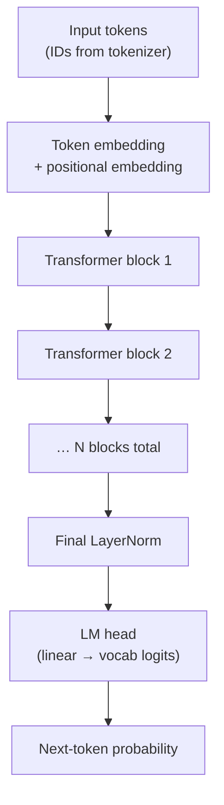
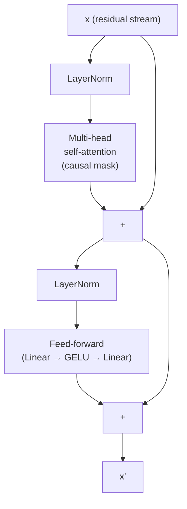

# 03 — Phase 1 Build Plan

Goal of Phase 1: build a tiny decoder-only transformer from scratch in PyTorch, train it on TinyStories, generate coherent toy text, and understand every line. ~10–50M parameters. Runs on a single GPU or (slowly) on CPU.

This is the **nanoGPT path**, but we'll build each piece with explanation, not just copy-paste.

## Architecture we're building

A decoder-only transformer, same family as GPT-2/3, Llama, Phi, Gemma:

Each transformer block:

The residual stream (the line that bypasses each sub-layer) is *the* key idea — every block adds its contribution, never replaces. We'll feel why this matters when training stability comes up.

## Step-by-step build sequence

Each step is a separate file in [`phase1-from-scratch/`](../phase1-from-scratch/) and an explainer in this docs folder when it ships.

### Step 1 — Data + Tokenization

- Download TinyStories (~500MB, ~2M short stories)
- Implement BPE (Byte-Pair Encoding) tokenizer or use a pre-trained one for now (we'll come back and write our own)
- Build a `Dataset` that returns `(input_ids, target_ids)` pairs where target is input shifted by one

**What you'll learn:** why tokenization shapes everything downstream — vocab size sets the embedding matrix size, the output head size, and the entire compute budget.

**Files:** `phase1-from-scratch/01_data.py`, `02_tokenizer.py`

### Step 2 — Embeddings + Positional Encoding

- Token embedding: a `vocab_size × d_model` lookup table
- Positional embedding: how the model knows position 5 differs from position 50 (we'll start with learned absolute, mention RoPE for context — Phi-3 and Llama use RoPE)

**What you'll learn:** attention is *position-blind* by default. Without positional info, "dog bit man" and "man bit dog" are the same tensor.

**File:** `phase1-from-scratch/03_embeddings.py`

### Step 3 — Self-Attention

- Implement scaled dot-product attention from scratch:
  `attn(Q, K, V) = softmax(QK^T / √d_k) V`
- Causal mask: each position can only see itself and prior positions (this is why it's a *decoder*-only model — no peeking at the future)
- Multi-head: project Q, K, V into `n_heads` parallel subspaces, attend, concatenate

**What you'll learn:** the O(n²) cost in sequence length — *every* token attends to *every* prior token. This is why long-context models are expensive and why KV caching matters for inference.

**File:** `phase1-from-scratch/04_attention.py`

### Step 4 — Transformer Block

- Pre-norm layout (LayerNorm before each sub-layer — more stable than post-norm)
- Attention + residual
- FFN (Linear → GELU → Linear, hidden dim usually 4× model dim) + residual
- Dropout (optional)

**What you'll learn:** why pre-norm is the modern default, why the FFN is wider than the residual stream, what "residual stream" means as a concept (Anthropic's transformer circuits framing).

**File:** `phase1-from-scratch/05_block.py`

### Step 5 — The Full Model

- Stack N blocks
- Final LayerNorm + LM head (often weight-tied to the input embedding)
- `forward(input_ids) → logits` and `forward(input_ids, targets) → (logits, loss)`

**What you'll learn:** weight tying (input embedding and output projection share weights), parameter counting, why model size is dominated by `vocab_size × d_model` at small scales and by attention/FFN at large scales.

**File:** `phase1-from-scratch/06_model.py`

### Step 6 — Training Loop

- DataLoader, batching
- CrossEntropyLoss (the natural loss for next-token prediction)
- AdamW optimizer with weight decay
- Learning rate schedule: warmup + cosine decay
- Gradient clipping
- Logging (loss curve, sample generations every N steps)

**What you'll learn:** why warmup matters at the start (large gradients blow up otherwise), why cosine decay vs. step decay, how loss "elbows" tell you the model is learning structure.

**File:** `phase1-from-scratch/07_train.py`

### Step 7 — Inference + Sampling

- Greedy decoding (always pick the argmax) — boring, repetitive
- Temperature sampling (divide logits by T before softmax)
- Top-k and top-p (nucleus) sampling
- Stopping criteria
- *Without* KV cache first, then add KV cache to see the speedup

**What you'll learn:** why greedy produces "the the the the", why high temperature produces gibberish, what KV cache actually caches (the K and V projections of every prior token at every layer — substantial memory but huge speedup).

**File:** `phase1-from-scratch/08_generate.py`

### Step 8 — Evaluation (sanity check)

- Loss on a held-out split
- Qualitative: generate 10 samples, eyeball them
- Perplexity (just `exp(loss)`)

We're not chasing benchmarks here — this model is too small to score on real ones. The goal is "it produces grammatical English about little kids and stories" rather than "it beats GPT-2".

## Target outcomes for Phase 1

By the end you should be able to answer, without looking it up:

- What's in the residual stream at layer L for token T?
- Why does attention scale as O(n²) and what does KV caching actually fix?
- Why does the FFN have a wider hidden dimension than `d_model`?
- What would happen if you removed the causal mask? (Hint: it becomes BERT-style, can't do generation.)
- Why is the output of the model `vocab_size` logits rather than one token?
- What does `temperature=0` mean and why does it differ from `temperature=0.01`?

When those feel obvious, Phase 1 is done. Then we move to Phase 2: take Phi-3-mini, LoRA-fine-tune it on Tesserix support transcripts, and start measuring real quality.

## Hardware reality check

| Setup | Time to train a usable 10M model on TinyStories |
|-------|-------------------------------------------------|
| Single L4 GPU on GKE | ~1–2 hours |
| Single RTX 3090/4090 locally | ~2–3 hours |
| Apple M-series (MPS backend) | ~6–10 hours |
| CPU only | overnight |

We don't need a cluster for Phase 1. The point is *understanding*, not scale.

## What we're explicitly NOT doing in Phase 1

To stay focused:

- No distributed training (we don't need it for this size)
- No mixed-precision (we'll add this once everything works in fp32)
- No quantization (a Phase 2/3 concern)
- No RLHF, DPO, or any preference tuning (Phase 2)
- No tool use, no agents (Phase 3)
- No RAG (Phase 3)

Build the foundation first. Skipping ahead is how you end up with a chatbot you can't debug.

---

When you're ready to start coding, the first file will be `phase1-from-scratch/01_data.py` and we'll walk through it together.
