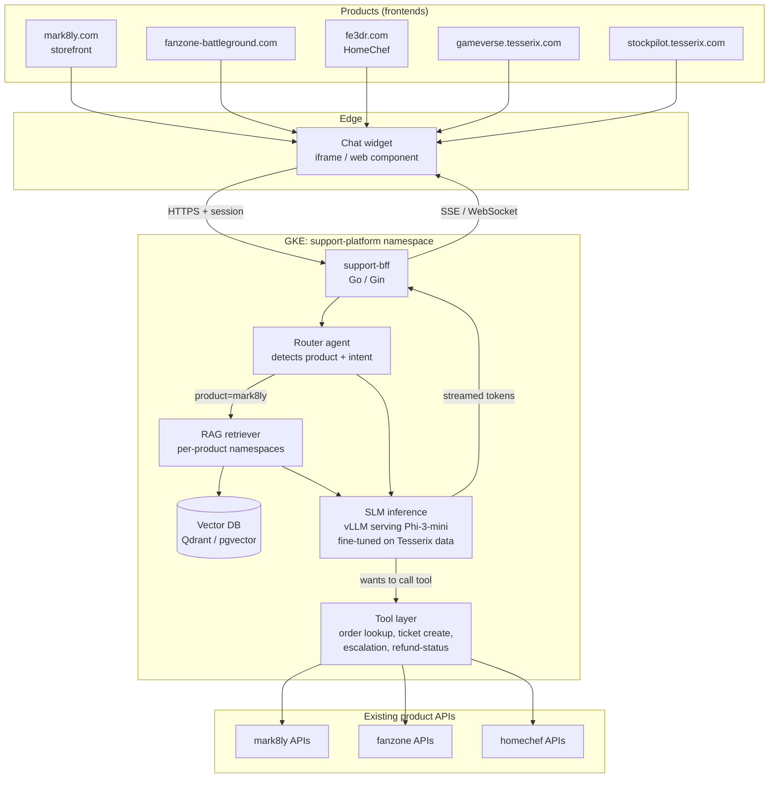

# Diagram — End-state production system

Standalone copy of the end-state Mermaid diagram for easy reference. Source of truth is [`../02-end-state-architecture.md`](../02-end-state-architecture.md).

## Request flow walkthrough (a HomeChef customer asks about their order)

1. Customer on `fe3dr.com` opens the chat widget, types "where's my order?"
2. Widget posts `{message, session_token, product="homechef"}` to `support-bff`
3. BFF validates session via existing HomeChef auth-BFF, attaches `user_id`
4. Router classifies: product=homechef, intent=order-status → needs tool
5. RAG retrieves `homechef/customer-faq` chunks about order tracking (in case the tool fails)
6. SLM receives: system prompt + RAG context + user message → emits a tool call: `lookup_order(user_id=...)`
7. Tool layer calls homechef-api `GET /orders/latest?user_id=...`, gets back order details
8. SLM receives tool result, generates natural-language response: "Your order #12345 is out for delivery, ETA 14:30"
9. Tokens stream back through BFF → widget → customer
