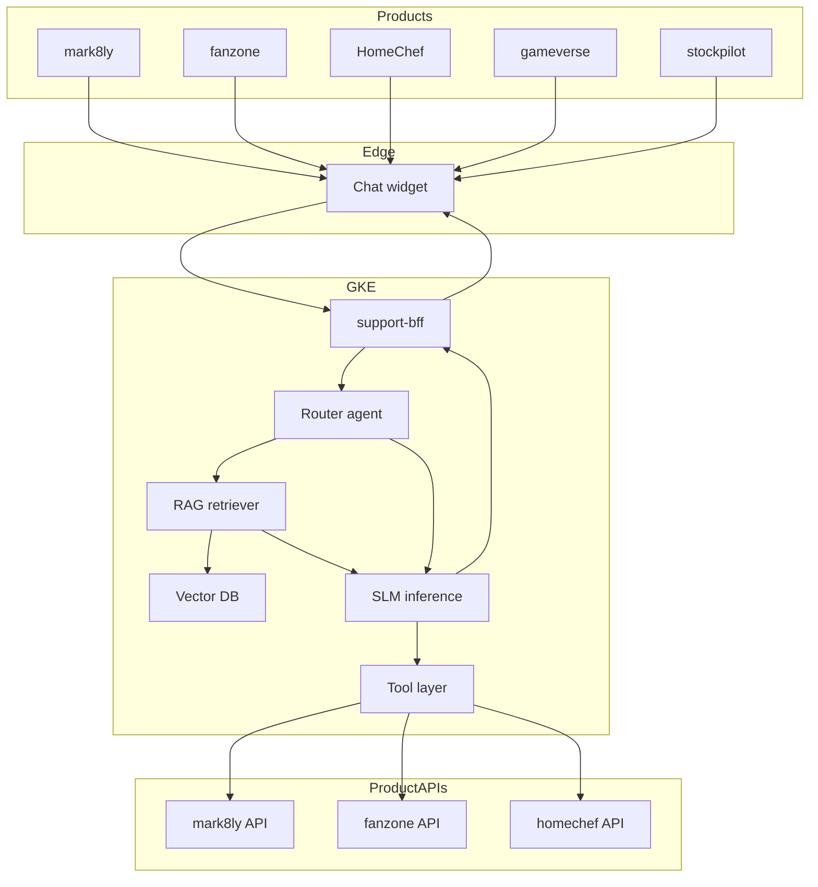

# Diagram — End-state production system

Standalone copy of the end-state Mermaid diagram for easy reference. Source of truth is [`../02-end-state-architecture.md`](../02-end-state-architecture.md).

## What each component is

- **Products** — your existing frontends. The chat widget is loaded by each one.
- **Chat widget** — small JS bundle, posts user messages to the BFF over HTTPS, streams tokens back.
- **support-bff** — Go/Gin service. Validates session, attaches product context, orchestrates the agent loop.
- **Router agent** — detects which product the user is on and what kind of question it is; picks the RAG namespace and prompt.
- **RAG retriever + Vector DB** — per-product namespaces (mark8ly, fanzone, homechef, …) holding embedded product docs.
- **SLM inference** — vLLM-served fine-tuned Phi-3-mini (or equivalent), runs on a single L4 GPU in-cluster.
- **Tool layer** — bridges from model "I want to look up an order" tokens to actual calls into product APIs.
- **Product APIs** — the existing per-product backends (homechef-api, mark8ly APIs, etc.).

## Request flow walkthrough (a HomeChef customer asks about their order)

1. Customer on `fe3dr.com` opens the chat widget, types "where's my order?"
2. Widget posts `{message, session_token, product="homechef"}` to `support-bff`
3. BFF validates session via existing HomeChef auth-BFF, attaches `user_id`
4. Router classifies: product=homechef, intent=order-status, needs a tool
5. RAG retrieves `homechef/customer-faq` chunks about order tracking (fallback if the tool fails)
6. SLM receives system prompt plus RAG context plus user message, emits a tool call `lookup_order(user_id=...)`
7. Tool layer calls homechef-api `GET /orders/latest?user_id=...`, gets back order details
8. SLM receives tool result, generates a natural-language reply: "Your order #12345 is out for delivery, ETA 14:30"
9. Tokens stream back through BFF to the widget to the customer
