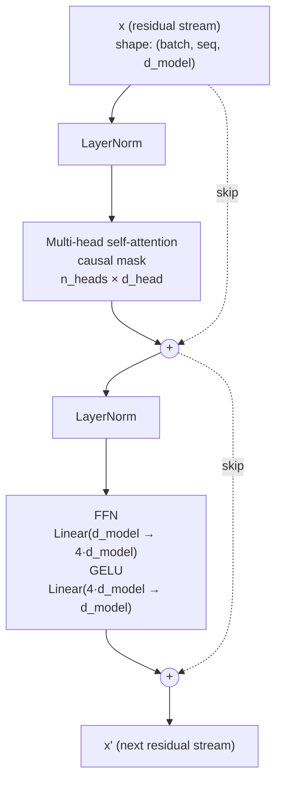
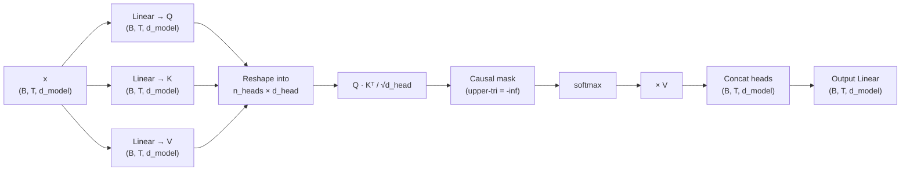
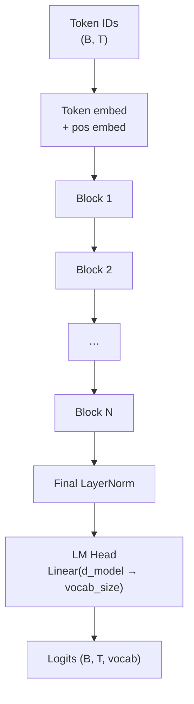

# Diagram — Transformer Block (the thing we're building in Phase 1)

Standalone reference for the decoder-only transformer block we'll implement in `phase1-from-scratch/05_block.py`.

## One transformer block (pre-norm layout)

## Multi-head attention internals

## Full model = stack of N blocks

## Key dimensions to remember

For our Phase 1 target (~25M params on TinyStories):

| Hyperparam | Value | Why |
|-----------|-------|-----|
| `vocab_size` | ~2,000–10,000 | TinyStories has a small vocabulary; smaller vocab = smaller embedding matrix |
| `d_model` | 256 | Width of the residual stream |
| `n_layers` | 6 | Depth |
| `n_heads` | 8 | `d_head = d_model / n_heads = 32` |
| `seq_len` | 256 | Max context window — TinyStories are short, no need for 2048+ |
| `ffn_hidden` | 4 × d_model = 1024 | Standard ratio |

Multiply it through: ~25M params, fits comfortably on a laptop GPU, trains in a couple hours.
